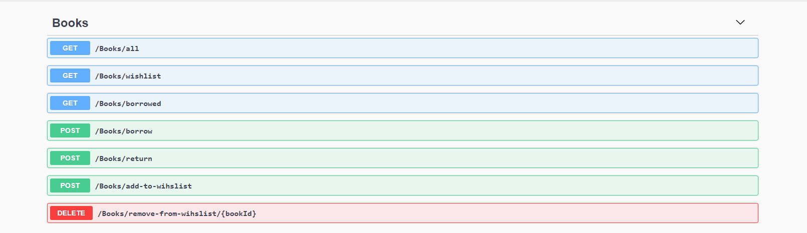
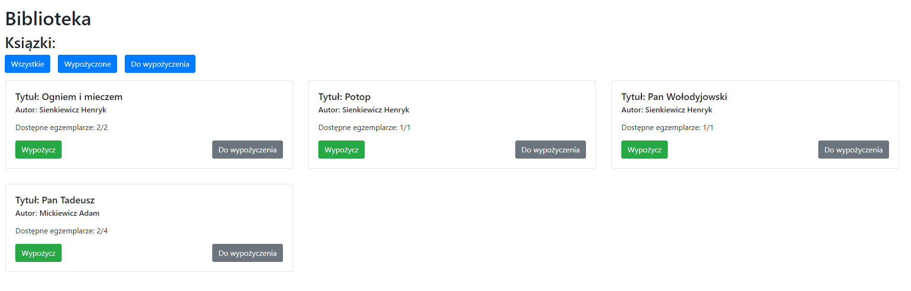
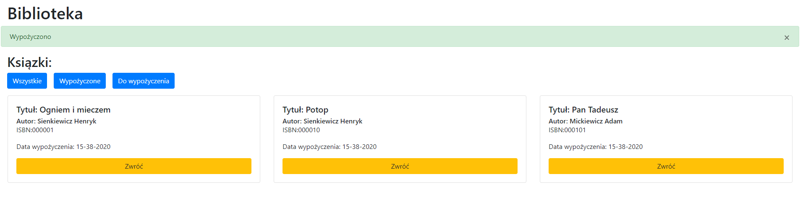

# E-Library
Web application for managing a library.

# Docker
The easiest way to run the application is run via docker.
Open terminal navigate to main foler E-Library and use docker compose to compile and start application `docker-compose up`.

# Local
## Database
MS Sql Serve

**Local instance:** downlaod and install sql server [link](https://www.microsoft.com/pl-pl/sql-server/sql-server-downloads)

**Docker** official image in [dockerHub](https://hub.docker.com/_/microsoft-mssql-server)

Exceute scripts from SQL directory

*create_db.sql* - creates new database and table schema
*test_data.sql* - populates the tables with test data

## E-Library-API
ASPN .NET Core app
### Instalation
Make sure you have installed .NET Core SDK 3.1. You can downloaded from [here](https://dotnet.microsoft.com/download/dotnet-core/thank-you/sdk-3.1.403-windows-x64-installer)

Navigate to ./E-Library and run following command from terminal
```
dotnet run
```
App is listening on port 5000

## E-Library-Frontend
Angular app
### Instalation
Required:
- Node.js [download](https://nodejs.org/en/download/)
- Angular CLI installed via npm `npm install -g @angular/cli`

Install required dependencies by running following command
```
npm install
```

Run the angular application
```
ng serve
```
By default app is running on port 4200

## REST API


## Screenshots


